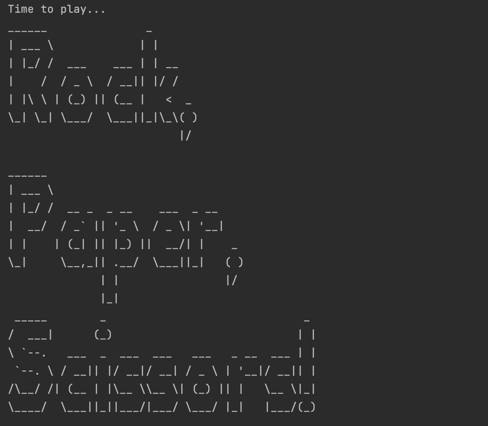
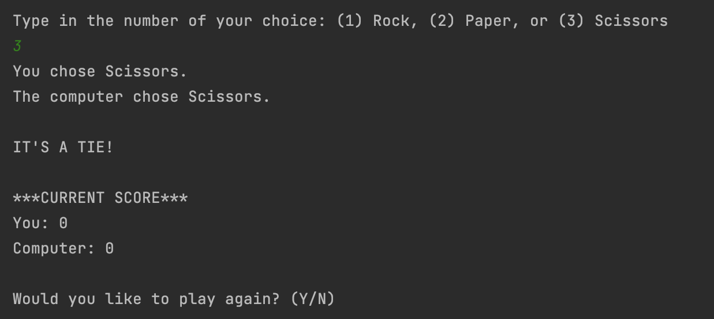

# rock-paper-scissors

This is a simple command line Rock Paper Scissors program created with Java.

## Table of contents

- [Overview](#overview)
  - [Screenshot](#screenshot)
  - [Links](#links)
- [My process](#my-process)
  - [Built with](#built-with)
  - [What I learned](#what-i-learned)
  - [Continued development](#continued-development)
- [Author](#author)

## Overview

### Screenshot

### Links

- URL: [GitHub Project Page](https://github.com/micamash/rock-paper-scissors)

## My process

### Built with

- Java
- IntelliJ

### What I learned

This was my first command line program created while I was learning Java.

### Continued development

I plan to continue developing my skills with Java.

## Author

- Website - [My GitHub](https://github.com/micamash)
